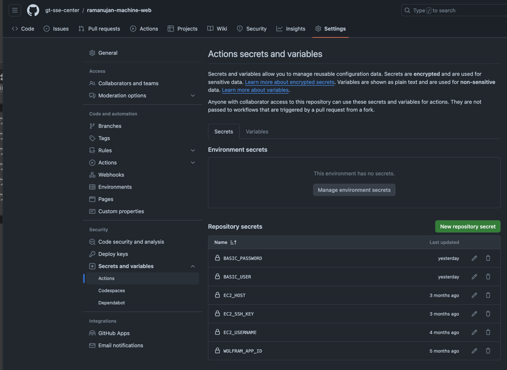
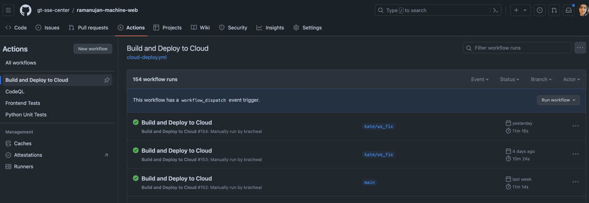
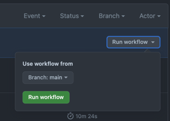

# Developer Documentation for the Ramanujan Machine Web Portal

## 1. Introduction

### 1.1. Project Overview

The web portal was developed by the [Virtual Institute for Scientific Software](https://www.schmidtsciences.org/viss/) sponsored [Scientific Software Engineering Center](https://ssecenter.cc.gatech.edu/) at the Georgia Institute of Technology in Atlanta, Georgia, USA. The original code is housed in the SSEC [GitHub repository](https://github.com/gt-sse-center/ramanujan-machine-web).

The repository comprises a complete web application, including web server code, React UI code and an automated deployment in GitHub Actions workflows that builds a Docker container and deploys it to a cloud server, currently AWS EC2.

### 1.2. Technologies Used

The web portal was written primarily in [Typescript](https://www.typescriptlang.org/docs/handbook/2/basic-types.html) and [Python](https://docs.python.org/3/tutorial/index.html). 

React was used in conjunction with Typescript to build the user interfaces. 

[d3.js](http://d3.js) was used to define a custom chart component. 

[MathJax](https://docs.mathjax.org/en/latest/) is used to pretty print mathematical expressions. 

[math.js](http://math.js) is used to parse and validate mathematical expressions.

Python was used to build the [FastAPI](https://fastapi.tiangolo.com/) web server that serves the [React](https://react.dev/) web portal user interface, as well as the [gRPC](https://grpc.io/docs/languages/python/quickstart/) server that wraps one of the underlying dependencies.

[Docker](https://www.docker.com/products/docker-desktop/) was used to build and bundle the web server, gRPC server and UI as well as their underlying dependencies.

The deployment comprises [GitHub Actions](https://docs.github.com/en/actions) workflows that run frontend and backend tests using [Cypress](https://www.cypress.io/) and [pytest](https://docs.pytest.org/en/8.2.x/) respectively.

The [Wolfram Alpha API](https://products.wolframalpha.com/api/documentation) is invoked from the web server and requires the use of an App ID. If you don't have an app id already, you can create one [here](https://developer.wolframalpha.com/). 

## 2. Getting Started

In order to work on the UI for the web portal, you will need [Node.js](https://nodejs.org/en/learn/getting-started/how-to-install-nodejs) installed for the purpose of frontend dependency management via [npm](https://docs.npmjs.com/cli/).

If you do not have a preferred web development IDE, [Visual Studio Code](https://code.visualstudio.com/) is a robust, free option that is popular in the web development community.

You will also require Python. The web portal was developed using Python 3.10.12 but this was purely a matter of timing and there is no reason to expect that the use of subsequent versions would cause any problems.

It is considered best practice to use a Python virtual environment when working on a Python application. There are several options for how to configure such a code bubble, but [venv](https://docs.python.org/3/library/venv.html) was used in the development of this project.

The easiest way to test your changes to the application is to spin up the Docker container. The root of the project contains a Dockerfile. While the [Docker Desktop](https://docs.docker.com/desktop/) is a great tool to have installed, features are slowly being transitioned to pay-only, so it is recommended that you familiarize yourself with the CLI. 

## 3. Project Structure

The project is broken up into 3 modules. The first is the web user interface, which resides in the react-frontend subdirectory. The web server, which serves the user interface and communicates with it via REST API and web sockets, resides in the python-backend directory. There is also a lirec-grpc-server directory that isolates LIReC into its own virtual environment and communicates via gRPC with the web server results returned by LIReC.

There are a few important files and folders at the root level. 

#### Dockerfile 
Dockerfile automates the dependency resolution, build and startup of all of the various components of the web portal, and kicks off the web and gRPC servers using **docker_start.sh**. 

#### .dockerignore
**.dockerignore** specifies which files are to be ignored by Docker when copying files to the container image.

#### .gitignore
**.gitignore** specifies which files are to be ignored by git respectively.

#### .github/workflows/ 
The .github/workflows/ directory houses all of the GitHub Actions yaml files. There are three with fairly descriptive names. 
* run-frontend-tests.yml runs frontend end-to-end Cypress tests, 
* run-backend-tests.yml runs pytest web server tests, and 
* cloud-deploy.yml deploys the docker image built using the Dockerfile to a cloud server.

### 3.1. Frontend (React)

The web user interface resides in the react-frontend subfolder. 

#### public/ 
The static assets live in this folder. The boilerplate favicon.ico and robots.txt live here. The image of the polynomial continued fraction that is displayed on the landing form is also in this directory.

#### src/ 
The majority of the code that you might want to modify is located in this folder.

#### App.css
App.css contains all of the CSS styling for the web portal.

#### index.tsx 
index.tsx loads the <App /> component from the App.tsx file to generate the index.html file that comprises the web portal.

#### vite.env.d.ts 
vite.env.d.ts contains definitions of environmental variables that need to be made available to the React application. The application will not be able to reference any environmental variables that are not defined in this file. `VITE_PUBLIC_IP` is the only such variable at the time of this writing and defines the hostname that the React application is to use to establish a web socket connection to the backend FastAPI web server.

#### src/lib/ 
This folder contains non-component Typescript code.

#### src/lib/constants.ts 
constants.ts contains details for LIReC provided constants that are not immediately available in LIReC's database but are defined here to match the sort of metadata that is provided by Wolfram Alpha so that we have consistency in the representation and content provided to the end user regardless of which source references a constant.

#### src/lib/types.ts 
types.ts contains type definitions for Typescript that are used in more than one component. 

#### src/components/ 
This folder contains all of the UI "components", which are essentially custom HTML tags with their own styling and Javascript behavior.

#### src/components/Form.tsx
The landing page form can be found in Form.tsx. 

#### src/components/PolynomialInput.tsx
Since there is similar validation used on the an and bn form fields, there is a PolynomialInput.tsx component to encapsulate this functionality.

#### src/components/Charts.tsx
Once the form is submitted, the results are displayed via the Charts.tsx component. 

#### src/components/ScatterPlot.tsx
The chart itself is displayed by the ScatterPlot.tsx component using d3.js.

The following root-level files are "fix it and forget it" configurations. They are generally untouched after the UI is first created.
#### package.json
The React application is defined in the package.json file, where the available npm commands and dependencies are listed. 
#### package-lock.json
package-lock.json is automatically generated when a build is executed.
#### tsconfig.json
Typescript settings can be found in the tsconfig.json file. Typescript is simply a type enforcement mechanism for use during development that gets converted to vanilla Javascript when the React application is "built".
#### vite.config.js
vite.config.js is where Vite settings reside. The frontend makes use of Vite to provide common local development tooling, including a lightweight development server with hot reload.
#### index.html
index.html is the template used during the frontend build process. It does not require modification. Any changes made to the body of this file will be replaced when the React code is bundled.
#### .prettierrc 
.prettierrc defines style preferences and is picked up by modern IDEs to format the code as you work. 
#### .eslintrc.json
.eslintrc.json  defines style preferences and is picked up by modern IDEs to format the code as you work. 
#### .eslintignore
.eslintignore lists paths that should not be formatted, e.g. third party dependencies. This exists because you want to break the build/deploy if your own conventions are not followed, but you don't want third party code to break your build, nor do you want to fix other npm libraries' stylistic choices.

### 3.2. Backend (FastAPI)

The web API server resides in the python-backend subfolder. 

#### logger.py
logger.py configures file and stdout logging. The format of log entries is defined here. An optional local parameter to the config function toggles logging at the debug.

#### main.py
The core of the web server can be found in main.py. The React application, as bundled by npm, is served as static files via the /form endpoint, which is the default endpoint. main.py is also where the REST endpoints are defined, as well as the web socket endpoint. The current log level is debug. If this is no longer desired, where the logger is configured in main.py via the config(), remove the parameter and the logging will reset to only logging warnings and errors.

#### input.py
input.py processes the inputs posted to the web server from the web form.

#### call_wrapper.py
Calls to ResearchTools occur from within call_wrapper.py, which essentially wraps these function invocations in a timeout.

#### wolfram_client.py 
wolfram_client.py encapsulates interactions with the Wolfram Alpha API. It is important to point out that a Wolfram API query can be no longer than 200 characters. The client logs a warning and truncates decimal numbers sent to Wolfram Alpha to 200 characters.

#### graph_utils.py
graph_utils.py converts the array of values returned from ResearchTools delta_sequence to x,y pairs that match the format expected by the ScatterPlot component in the React UI.

#### constants.py
constants.py contains some global settings for the web server. 

* DEFAULT_PRECISION, which sets the decimal precision for computations throughout the application via mpmath.mp.dps. 

* VERBOSE_EVAL turns on verbose logging for evalf. 

* EXTERNAL_PROCESS_TIMEOUT defines how many seconds to wait before throwing a timeout in the call_wrapper.

### 3.3 Backend (gRPC)

The gRPC server, which communicates with the web server and isolates LIReC into its own virtual environment for compatibility reasons, resides in the lirec-grpc-server subfolder. It relies on a lirec.proto file which lives in the protos sibling directory. 

**constants.py** and **logger.py** come from python-backend and the contents are a subset of the content of those files.

The only file that matters for the gRPC server is **server.py**. All other .py files are auto generated, if present (they should not be committed).

## 4. Running the Application Locally

### 4.1. Docker Mode (recommended)

Running the web portal in Docker is the easiest option. There is a Dockerfile at the root of the repository which automates the installation of requirements, configuration of virtual environments, setting of parameters, and building and startup of the components.

Once you have a Wolfram App ID, and you have Docker installed, you will need to create a .creds file in the root of the repository. The contents of this file will be loaded as secrets to the Docker build. The contents should look like the following, with your values substituted for "user", "password" and "ABCDEF-ABCDEFGHIJ":

    BASIC_USER=user
    BASIC_PASSWORD=password
    WOLFRAM_APP_ID=ABCDEF-ABCDEFGHIJ

You should then be able to build and run the web portal with the following commands executed in the same directory in which the Dockerfile is located (the root of the repository):

    docker build --build-arg public_ip=localhost -t ramanujan-machine-web-portal:latest .

    docker run -p 80:80 -d ramanujan-machine-web-portal:latest

You should be able to open any browser and access the web portal running in docker by entering "localhost" in the address bar. The build-arg where localhost is set is used for internal communication between the web server and client via websocket and the web server and gRPC server. These values are passed into the docker build command via GitHub Actions using GitHub secrets when deploying to production.

### 4.2. Dockerless Mode

<em>It is highly recommended that you build and test using Docker mode</em>, especially since that is how the application is configured to deploy to production via GitHub Actions. Running the application using Docker ensures that all of the components can interact successfully. Given Docker's caching, making a change in any part of the application only rebuilds the affected components which makes for fast and thorough debugging. That said, reading through this process will give you a better understanding of how the application components come together and interact.
What follows is the details for how to deploy the components without the automation that the Dockerfile provides. 
Set your environment variables. 

`WOLFRAM_APP_ID` to your Wolfram provided app ID.

`VITE_PUBLIC_IP` to `localhost` or wherever you plan to launch the python-backend.

From within the react-frontend directory, execute the following commands.

This command install NodeJS dependencies.

    $ npm ci

This command transpiles the Typescript to Javascript, minifies the CSS and Javascript, and pulls in any static assets referenced in the code, dropping the result in the build/ subfolder.

    $ npm run build

This command spins up a local server. It will inform you of the URL on which the server is running.

    $ npm run serve

From within the python-backend directory, create a virtual environment, activate it and install the dependencies found in the requirements.txt file. 

Note: The Docker application runs on ubuntu latest, and it was necessary to install the following Linux packages prior to installing all of the Python dependencies: 

* libpq-dev 
* libgmp-dev 
* libgmp3-dev 
* libmpfr-dev 
* libmpc-dev

Start the web server with the following command:

    uvicorn main:app --host "0.0.0.0" --port 80 &

Install the following Python packages globally:  
	grpcio  
    grpcio-tools  

Execute the following commands to turn the proto file into Python code for both the web server and gRPC server so that they can communicate:

    python -m grpc_tools.protoc --proto_path=protos --python_out=python-backend/ --grpc_python_out=python-backend/ protos/lirec.proto

    python -m grpc_tools.protoc --proto_path=protos --python_out=lirec-grpc-server/ --grpc_python_out=lirec-grpc-server/ protos/lirec.proto

From within the lirec-grpc-server directory, create and activate a virtual environment and install dependencies from the requirements.txt. 

Start the gRPC server with the following command:

    python server.py &

You should now be able to see the web portal when you access http://localhost with your browser of choice.

## 5. Testing

### 5.1. Unit Tests

Unit tests for the python-backend can be run using pytest. They are executed as part of the GitHub Actions automatically when the code is pushed up to GitHub.

### 5.2. End-to-End Tests

The react-frontend uses Cypress to run end to end tests. They are executed as part of the GitHub Actions automatically when the code is pushed up to GitHub. The React app has to be running for the tests to execute. 

The following command runs end-to-end tests on the command line.

    npx cypress run

The following command runs the same end-to-end tests visually in a web browser.

    npx cypress open

These commands work with the React app being accessible on localhost at port 5173 (the default dev port for React+Vite). This can be aimed at the web portal running in the Docker container by modifying the URL at the top of react-frontend/cypress/e2e/frontend/test.cy.js, or you can run the Docker container at port 5173. 

## 6. Deployment

The deployment process consists of a GitHub Action that builds the Docker image and deploys it to a cloud host. The process is defined in the .github/workflows/cloud-deploy.yml file. 

You will need to have all of the values defined in the .creds file for local deployment defined as GitHub secrets on your repo for this workflow to succeed. You can find the secrets configuration at the following URL: https://github.com/<your org or user>/<your repo>/settings/secrets/actions or on the Settings tab:

There are additional secrets needed to deploy to AWS EC2. These are:

* `EC2_HOST` which should be set to the IP address or URL for your cloud server. This value is used for the web socket connection between the UI and the web server.
* `EC2_USERNAME` which should be set to the SSH user for your AWS EC2 instance.
* `EC2_SSH_KEY` which should be set to the private key for your EC2 instance.

The deployment process is manually triggered. In the Actions tab of your repository, you should see the "Build and Deploy to Cloud" action on the left navigation menu. Clicking on this action should show you a list of prior executions. In the upper right of the list you will find a "Run workflow" button. 

Clicking on this button will allow you to select which branch to run the deployment from:

### 6.1 Embedding in Your Web Page

The web server has been configured to embed into https://www.ramanujanmachine.com/. You can find this configuration in python-backend/main.py. Very simply, the x-frame-options header is set to "ALLOW-FROM https://www.ramanujanmachine.com" to support embedding. Adding a snippet such as the following should be sufficient in the HTML of your web page:

    <iframe id="rmwp" title="Ramanujan Machine Web Portal" 
      width="700" height="800" 
      src="http://123.123.123.123/form">
    </iframe>

You will have to adjust the IP address to that of your hosting server. Feel free to adjust the id, title, width and height to whatever values you prefer. Refer to the official iframe documentation for additional details and options.

## 7. Maintenance

### 7.1. Updating Dependencies

GitHub's Dependabot should be enabled for the repository. It will create PRs for critical dependency updates. 

To maintain the React dependencies on your own, you can invoke `npm outdated` to see a list of dependencies that need attention. The concerning ones will be presented in red type. From here you can upgrade dependencies using `npm upgrade <package name>`.

For both python-backend and lirec-grpc-server, upgrade the Python dependencies listed in the requirements.txt file however you choose, making sure to freeze them back to the requirements file when finished.
